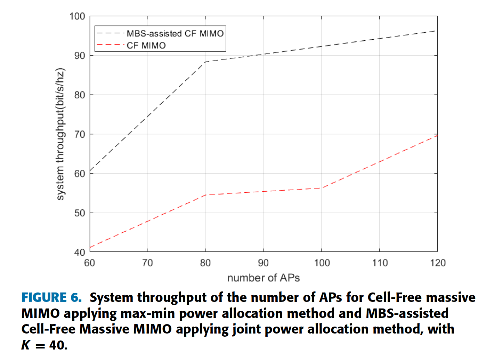

[← Back to Home]({{ site.baseurl }}/)

# UAV and mmWave Operation in CF mMIMO

## UAVs in Future Wireless Networks

- UAVs (Unmanned Aerial Vehicles) act as **flying base stations**.  
- Can dynamically move to **fill coverage holes** and enhance capacity.  
- Offer **Line-of-Sight (LoS)** advantage compared with ground APs.  
- Increasingly used in **surveillance, delivery, and communications**.

- UAV（無人航空機）は**飛行型基地局**として機能。  
- **通信エリアの空白**を補い、ネットワーク容量を向上させる。  
- 地上APに比べて**見通し通信（LoS）**が得やすい。  
- **監視・配送・通信**など多様な分野で利用が拡大中。

---

## UAVs as Users in CF mMIMO (refs 136, 137)

- CF mMIMO = many distributed APs jointly serve all users (no cells).  
- Enables **stable uplink/downlink** even for high-altitude UAVs.  
- Studies 136 and 137 show: **CF mMIMO outperforms conventional systems**.  
- Especially **robust at high altitudes** due to no cell-edge interference.

- CF mMIMO = 多数の分散APがセル境界なしで全ユーザを協調サポート。  
- 高高度UAVでも**安定した上り・下りリンク**を実現。  
- 文献 136 および 137 は、**従来方式より優れた性能**を示している。  
- セル境界干渉がないため、**高高度で特に安定性が高い**。

### Fig. 6 — UAV UL Rates under Different Architectures (ref 136)

CF mMIMO achieves higher UL rates for UAVs than traditional cellular mMIMO and user-centric mMIMO,  
as shown by the right-shifted blue curves in the CDF.  
This demonstrates its superior interference management and consistent link quality.  

CF mMIMO は cellular mMIMO および user-centric mMIMO よりも UAV の上りリンク速度が高く、  
CDF の青い曲線の右方向シフトにより、干渉抑制とリンク安定性の優位性を示している。  

---

## UAV-Aided CF mMIMO (refs 138, 139)

- UAVs can **assist networks** (not only act as users).  
- 138 → UAV + Aerial RIS (AIRS) improves DL rate for users in bad channels.  
- Jointly optimize **UAV position + RIS reflection phase**.  
- 139 → UAV as **mobile base station (MBS)** for CF mMIMO cooperation.  
- Uses **trajectory optimization + power control** to enhance QoS.

- UAVは**ユーザとしてだけでなく、ネットワーク支援装置**にもなる。  
- 文献 138：UAVに**空中RIS (AIRS)** を搭載 → 悪条件ユーザのDLレートを改善。  
- **位置＋反射位相の同時最適化**で性能を向上。  
- 文献 139：UAVを**移動型基地局**として利用し、CF mMIMO と連携。  
- **軌道最適化＋電力制御**で全体の QoS を改善。

### Fig. 7 — Performance Comparison with/without AIRS (ref 138)
 
With AIRS location optimization, the achievable DL rate increases dramatically.  
Joint optimization of UAV position, AP beamforming, and AIRS phase shift leads to higher efficiency.  

AIRS 位置を最適化することで DL レートが大幅に向上。  
UAV の位置、AP ビームフォーミング、および AIRS 位相の同時最適化による効果を示す。  

 
### Fig. 6 — System Throughput vs Number of APs (ref 139)

MBS-assisted CF mMIMO shows significant throughput gain over conventional CF mMIMO by joint trajectory and power optimization.  

軌道 および 電力 の最適化により、MBS 支援 CF mMIMO が従来方式より高い スループット を達成。

---

## Comparison and Summary

**UAV as User (refs 136, 137)**  
→ CF mMIMO enhances UAV DL/UL rates via cooperative APs.  
**UAV as Helper (refs 138, 139)**  
→ UAVs with RIS or MBS functions improve system QoS.  

**UAV を ユーザ として扱う場合 (136, 137)**：  
→ CF mMIMO の協調により UAV の上下リンク性能が向上。  
**UAV を 支援側 として扱う場合 (138, 139)**：  
→ RIS 搭載や 移動基地局化 により システム全体の QoS を改善。  

Together these studies show UAVs can both **benefit from** and **enhance** CF mMIMO systems.  

これらの研究は、UAV が CF mMIMO の恩恵を受けるだけでなく、ネットワークを強化する側にもなり得ることを示しています。  

| Role of UAV | References | Key Focus | Main Finding |
|--------------|-------------|------------|---------------|
| As User | 136, 137 | Compare CF vs Cellular MIMO | CF improves UAV DL/UL rates |
| As Helper / BS | 138, 139 | Optimize UAV position, RIS, and power | Improves overall system QoS |

---

## CF mMIMO in mmWave Bands — Overview (ref 140)

- High-frequency bands such as **mmWave, terahertz, optical wireless** are key technologies for **5G and beyond**.  
- Offer **immense bandwidth** compared with sub-6 GHz microwave bands.  
- **CF mMIMO** in these bands leverages **short wavelengths** to pack many antennas in small areas.  
- This allows **fine-grained narrow beams**, significantly improving communication links (140).

- **ミリ波・テラヘルツ・光無線** などの 高周波数帯 は、**5G 以降の通信** を 支える 重要技術。  
- **サブ 6 GHz 帯より 広い帯域幅** を 提供。  
- **短波長** を 活かして、**高密度アンテナ配列** が 可能。  
- **精密な狭ビーム形成** に より通信品質が 大幅 に 向上 (140)。

### Fig. 38 — Number of Antenna Elements vs Frequency (ref 140)

Higher frequencies require more antennas to compensate for greater path loss.  

周波数が高くなるほど パスロス 補償 のために 必要な アンテナ数 が 増加。  

---

## Candidate mmWave Frequency Bands for 5G and Beyond (ref 141)

- The **mmWave spectrum (3 – 300 GHz)** includes both *super high* (3–30 GHz) and *extremely high* (30–300 GHz) bands.  
- The **FCC (2016)** designated specific bands for 5G mobile broadband (141):  
  - **28 GHz band (27.5 – 29.5 GHz)** → ~1 GHz available for mobile broadband.  
  - **70 – 80 GHz bands (E-band)** → 10 GHz total for backhaul and mobile links.  
  - **90 GHz band (W-band)** → 92 – 100 GHz for fixed and mobile services.  
- **Total available bandwidth: 24 GHz** for future high-capacity wireless systems.

- **ミリ波帯 (3〜300 GHz)** には、超高周波 (3〜30 GHz) と 極超高周波 (30〜300 GHz) が 含まれる。  
- **FCC (2016)** は 5G 移動通信向けに 次の帯域を 割り当て (141)：  
  - **28 GHz 帯 (27.5〜29.5 GHz)** → 約 1 GHz が モバイル通信 向け。  
  - **70〜80 GHz 帯 (E バンド)** → 合計 10 GHz が バックホール 通信 と 移動 通信 に 利用。  
  - **90 GHz 帯 (W バンド)** → 92〜100 GHz が 固定 ・ 移動 通信 に 利用。  
- **総利用可能帯域幅 24 GHz** → 将来の 大容量通信 に 有望。
