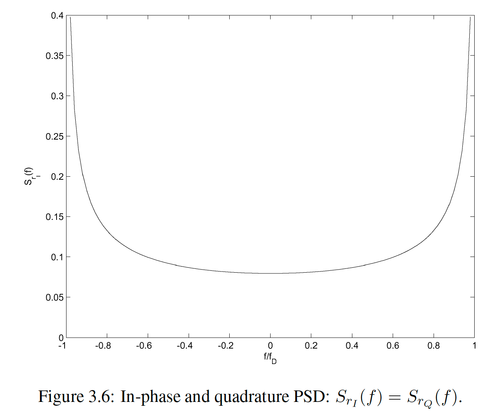
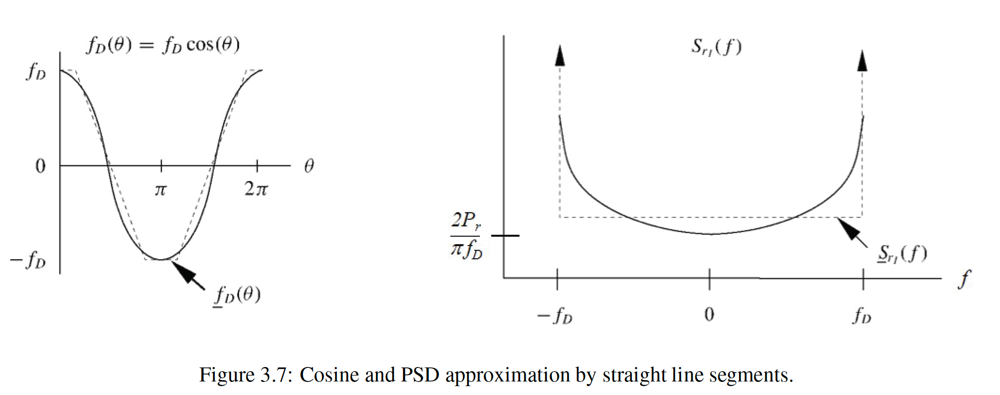
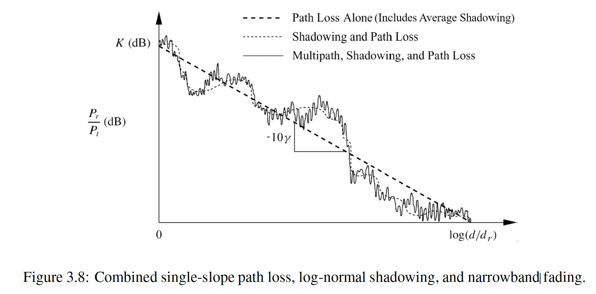
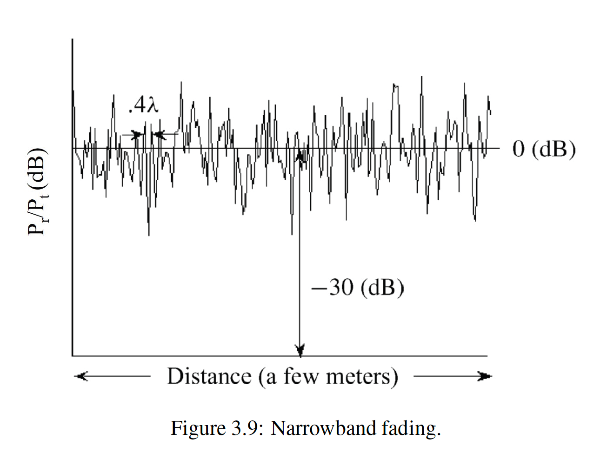
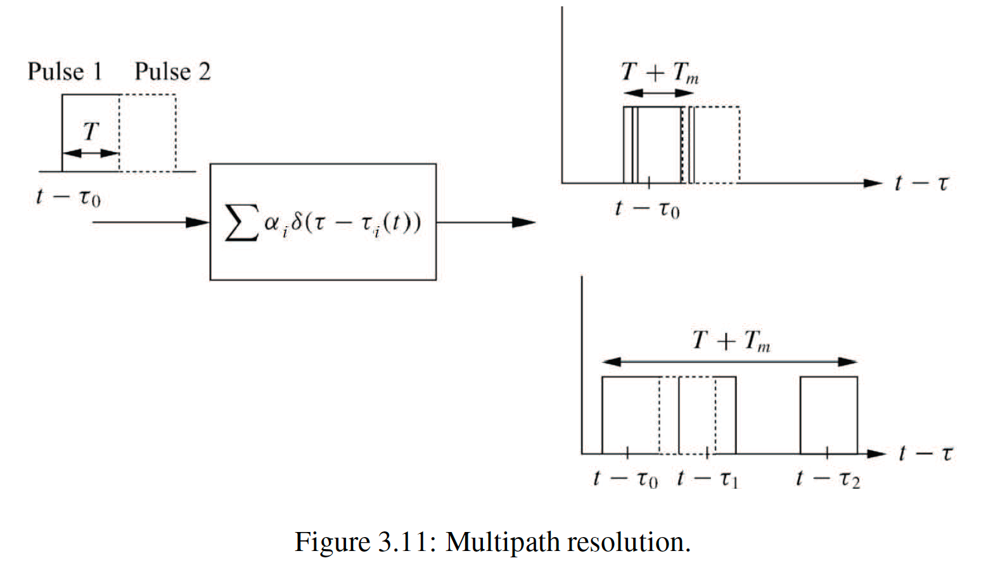

<link rel="stylesheet" href="{{ site.baseurl }}/assets/css/custom.css">



[← Back to Home]({{ site.baseurl }}/)

# Wireless Communications Chapter3

### PSD as pdf of Doppler Frequency

- PSD $S_r(f)$: describes how multipath power is distributed over Doppler frequency.
- So $S_r(f)$ can be interpreted as the **pdf of random Doppler frequency** due to multipath.
- From Fig. 3.6:
  - Doppler PSD $S_{r_I}(f)$ → ∞ at $f = \pm f_D$.
  - Hence overall PSD $S_r(f)$ → ∞ at $f = \pm f_c \pm f_D$.
- In practice:
  - Uniform-scattering model is idealized; real PSD just **peaks** near $f \approx f_c \pm f_D$.
- Intuition:
  - Doppler shift $f_D(\theta)$ is cosine-shaped.
  - Under the model, PSD $S_r(f)$ ≈ pdf of random Doppler frequency $f_D(\theta)$.

---

### Uniform Scattering and Doppler pdf 

- Under **uniform scattering**, angles of arrival θ are uniformly distributed on $[0, 2\pi]$.
- Doppler shift:
  \[
  f_D(\theta) = f_D \cos(\theta)
  \]
- The pdf of Doppler frequency:
  \[
  p_{f_D(\theta)}(f) \propto \text{density of scatterers at Doppler } f
  \]
- Thus PSD:
  \[
  S_r(f) \propto p_{f_D(\theta)}(f)
  \]
- Fig. 3.7:
  - Left: cosine Doppler shift vs. angle.
  - Right: PSD $S_r(f)$ approximated using straight-line segments.
  - Edges at $f = \pm f_D$ correspond to high density (“delta-like” peaks).

---

### Using PSD to Simulate Narrowband Fading

- Goal: generate a synthetic narrowband fading process with a specified PSD.
- Method (as described in the text):
  - Create two independent white Gaussian noise sources.
  - Both noises have PSD $ N_0/2 $.
  - Pass them through identical lowpass filters with frequency response $ H(f) $.

***Why (3.32) Holds — Simple PSD Shaping Principle***

- A white noise source has **flat PSD**:
  \[
  S_{\text{in}}(f) = \frac{N_0}{2}.
  \]
- After passing through a filter with gain $ H(f) $, each frequency component is
  scaled by $ H(f) $.
- Therefore the output PSD becomes:
  \[
  S_{\text{out}}(f) = \frac{N_0}{2} |H(f)|^2.
  \tag{3.32}
  \]

- Outputs correspond to the **in-phase (I)** and **quadrature (Q)** components.
- Selecting $H(f)$ shapes the spectrum to match the desired fading PSD.
- Communication simulation toolboxes (e.g., MATLAB) implement this PSD-shaping method.

---

### Power Variations in Narrowband Wireless Channels

This paragraph combines three components of received power variation:
1. **Path loss** (large-scale, deterministic trend)
2. **Shadowing** (slow variations, log-normal)
3. **Narrowband multipath fading** (fast variations, wavelength scale)

- The dashed line represents **path loss only**, decreasing at slope  
  $-10\gamma$ dB/decade relative to $\log_{10}(d/d_r)$.
- The dotted line shows **path loss + shadowing**, where the shadowing
  fluctuations occur over the decorrelation distance $X_c$.
- The solid, highly irregular curve shows **path loss + shadowing + multipath**.
- Multipath introduces *very fast* fluctuations on the order of  
  **half a wavelength**.

- “Zoomed-in” over a few meters where path loss and shadowing are constant.
- Shows fast Rayleigh-like fluctuations of $P_r/P_t$ (0 dB mean, variations up to -30 dB).
- A mobile receiver traveling at constant velocity $v$ sees a *stationary* and *ergodic* fading process.

---

### 3.2.2 Envelope and Power Distributions

We consider the narrowband received signal:

\[
r(t) = r_I(t)\cos(2\pi f_c t) - r_Q(t)\sin(2\pi f_c t)
\]

Both $ r_I(t) $ and $ r_Q(t) $ are **zero-mean Gaussian** RVs with equal variance $ \sigma^2 $.

Thus, the envelope is:

\[
z(t) = |r(t)| = \sqrt{r_I^2(t) + r_Q^2(t)}
\]

Since the magnitude of two i.i.d. Gaussian variables follows a Rayleigh distribution,  
the pdf of $ z $ is:

\[
p_Z(z)
= \frac{2z}{P_r}\exp\left(-\frac{z^2}{P_r}\right),
\qquad z \ge 0
\]

where the average received power is:

\[
P_r = 2\sigma^2
\]

***Derivation Sketch***

1. Start with:
   - $ r_I(t), r_Q(t) \sim \mathcal{N}(0,\sigma^2) $
2. Define envelope:  
   $ z = \sqrt{r_I^2 + r_Q^2} $
3. Joint Gaussian → transform to polar coordinates:
   - Radius $ z $ has Rayleigh pdf
4. Rayleigh pdf:
   \[
   p_Z(z)=\frac{z}{\sigma^2}\exp\left(-\frac{z^2}{2\sigma^2}\right)
   \]
5. Substitute:
   \[
   P_r = 2\sigma^2
   \]
   → final form becomes textbook eq. (3.33):

   \[
   p_Z(z)=\frac{2z}{P_r}\exp\left(-\frac{z^2}{P_r}\right)
   \]

---

### Power Distribution via Change of Variables

We obtain the power distribution by applying the change of variables:

\[
z^2(t) = |r(t)|^2
\]

Using this substitution in the Rayleigh envelope pdf (3.33), we get:

\[
p_{Z^2}(x)
= \frac{1}{P_r} e^{-x/P_r}, \qquad x \ge 0
\tag{3.34}
\]

***Mean power of the narrowband signal***

The average power of $ r(t) $ is:

\[
P_r = 2\sigma^2
\]

Thus:
- the amplitude $ r(t) $ is **Rayleigh distributed**
- the instantaneous power is **exponentially distributed** with mean $ P_r = 2\sigma^2 $

***Equivalent lowpass representation***

The equivalent lowpass signal is defined as:

\[
r_{LP}(t) = r_I(t) + j r_Q(t)
\]

It has:
- the same power as the envelope $ z(t) $
- phase:
\[
\theta = \arctan \left( \frac{r_Q(t)}{r_I(t)} \right)
\]

Since $ r_I(t) $ and $ r_Q(t) $ are independent zero-mean Gaussian variables:

- $ \theta $ is **uniformly distributed**
- $ \theta $ is **independent** of \( |r_{LP}| \)

***Derivation (Change of Variables)***

Let:

\[
x = z^2, \qquad z = \sqrt{x}
\]

Rayleigh pdf:

\[
p_Z(z) = \frac{2z}{P_r} \exp\left(-\frac{z^2}{P_r}\right)
\]

Jacobian:

\[
\frac{dz}{dx} = \frac{1}{2\sqrt{x}}
\]

Then:

\[
p_{Z^2}(x)
= p_Z(\sqrt{x}) \cdot \frac{1}{2\sqrt{x}}
= \frac{2\sqrt{x}}{P_r} 
  \exp\left(-\frac{x}{P_r}\right)
  \cdot \frac{1}{2\sqrt{x}}
\]

\[
\boxed{
p_{Z^2}(x)=\frac{1}{P_r}e^{-x/P_r}
}
\]

---

### Example 3.2

Consider a channel with Rayleigh fading and average received power:

- $P_r = 20 \text{ dBm} = 100 \text{ mW}$

We want to compute the probability that the received power is:

\[
Z^2 < 10 \text{ dBm} = 10 \text{ mW}
\]

From earlier results:

\[
p_{Z^2}(x) = \frac{1}{P_r} e^{-x/P_r}, \qquad x \ge 0
\]

Given $P_r = 100\ \text{mW}$, we compute:

\[
\Pr(Z^2 < 10)
   = \int_0^{10} \frac{1}{100} e^{-x/100}\, dx
\]

Final Result

\[
\Pr(Z^2 < 10) = 0.095
\]

Thus, in this Rayleigh fading channel,  
the probability that the received power is below $10\ \text{mW}$ is **9.5%**.

---

### Rician Fading

#### 1. Model Overview
When a **LOS (line-of-sight) component** exists, the received in-phase and quadrature components become:
- $ r_I = s_I + n_I $
- $ r_Q = s_Q + n_Q $

Where:
- $ s_I, s_Q $: deterministic LOS components  
- $ n_I, n_Q \sim \mathcal{N}(0,\sigma^2) $: scattered Gaussian components  
- LOS amplitude:

\[
s = \sqrt{s_I^2 + s_Q^2}
\]

Thus, the received envelope is:

\[
z = \sqrt{r_I^2 + r_Q^2}
\]

#### 2. Rician Envelope PDF

Because $r_I$ and $r_Q$ are Gaussian with **nonzero means**,  
$z$ follows the **Rician distribution**:

\[
p_Z(z)
= \frac{2z}{P_r}
\exp\!\left( -\frac{z^2 + s^2}{P_r} \right)
I_0\!\left( \frac{2zs}{P_r} \right),
\qquad z \ge 0
\tag{3.34}
\]

Where:
- $I_0(\cdot)$ is the modified Bessel function of order 0.

#### 3. Rice Factor $K$

LOS vs. scattered power ratio:

\[
K = \frac{s^2}{2\sigma^2}
\tag{3.35}
\]

- $K = 0$: Rayleigh fading  
- Larger $K$: stronger LOS, weaker fading  

#### 4. Average Received Power

\[
P_r 
= \int_0^\infty z^2\, p_Z(z)\, dz
= s^2 + 2\sigma^2
\tag{3.36}
\]

Interpretation:
- LOS contributes $s^2$
- Scattered components contribute $2\sigma^2$

#### 5. Rician PDF in Terms of $K$

Substitute:

\[
K = \frac{s^2}{2\sigma^2},
\qquad
P_r = 2\sigma^2(1 + K)
\]

Into (3.34), giving:

\[
p_Z(z)=
\frac{2z(1+K)}{P_r}
\exp\!\left( -K - (1+K)\frac{z^2}{P_r} \right)
I_0\!\left( 2z\sqrt{ \frac{K(1+K)}{P_r} } \right)
\tag{3.37}
\]

#### 6. Normalized Envelope PDF

Let $ u = z / \sqrt{P_r} $.  
Then pdf becomes:

\[
p_U(u)=
2u(1+K)
\exp\!\left( -K - (1+K)u^2 \right)
I_0\!\left( 2u\sqrt{K(1+K)} \right)
\tag{3.38}
\]

This form is commonly used for normalized fading analysis.

‘’‘
It is called the Rice factor because the Rician fading model was originally derived by Stephen O. Rice, and the parameter 
𝐾 
K follows his naming convention in the classical Rice distribution.

---

### Nakagami Fading Distribution

#### 1. Motivation
- Rayleigh and Rician fading distributions are widely used, but some measurement data cannot be well-fitted by either model.
- A more general and flexible model is needed → **Nakagami fading distribution**.
- Its parameters can be tuned to match a wide range of empirical fading behaviors.

#### 2. Envelope Distribution (Eq. 3.39)

The PDF of the Nakagami fading envelope $ z $ is:

\[
p_Z(z) =
\frac{2 m^m z^{2m - 1}}{\Gamma(m) P_r^m}
\exp\left( -\frac{m z^2}{P_r} \right), 
\qquad m \ge 0.5
\]

##### Parameters
- $ P_r $: average received power  
- $ \Gamma(\cdot) $: Gamma function  
- $ m $: fading parameter controlling severity

#### 3. Important Special Cases

##### **(1) Rayleigh fading**
\[
m = 1 \quad \Rightarrow \text{Nakagami reduces to Rayleigh fading}
\]

##### **(2) Rician approximation**
\[
m \approx \frac{(K + 1)^2}{2K + 1}
\]

The Nakagami distribution resembles a Rician distribution with parameter $K$.

##### **(3) No fading**
\[
m \rightarrow \infty \quad \Rightarrow \quad z = \sqrt{P_r} \text{ (constant)}
\]

#### 4. Flexibility of Nakagami Fading
- Capable of modeling Rayleigh, Rician, and more general fading environments.
- Measurement studies report:
  - $ m < 1 $: fading **more severe** than Rayleigh  
  - $ m > 1 $: **milder** fading

#### 5. Power Distribution (Eq. 3.40)

Using the variable change $ x = z^2 $:

\[
p_{Z^2}(x) =
\left( \frac{m}{P_r} \right)^m
\frac{x^{m - 1}}{\Gamma(m)}
\exp\left( -\frac{m x}{P_r} \right)
\]

This expression gives the distribution of **received power** under Nakagami fading.

---

### Extensions to Narrowband Fading Models

While narrowband fading is often modeled using **Rayleigh**, **Rician**, or **Nakagami** distributions,  
these classical models are **not accurate** for many real environments.

This limitation has led to **important extensions** of the basic models.

##### Hoyt (Nakagami-q) Distribution

- Models narrowband fading when the **instantaneous in-phase and quadrature components**  
  are **zero-mean Gaussian random variables**  
  **with unequal variances**.
- Provides a better fit for channels where scattering conditions are imbalanced.

##### Beckmann Distribution

- Generalizes the Hoyt model.
- Allows **in-phase and quadrature components** to be **Gaussian with unequal means and unequal variances**.
- More flexible for environments where LOS or partial-LOS components introduce bias.

##### Weibull Fading Model

- Generalizes **both Rayleigh and exponential distributions**.
- With proper parameterization, it has been shown to **fit experimental data** well.
- Useful for environments where fading severity deviates from classical Rayleigh.

##### References

The pdf formulas for the **Hoyt**, **Beckmann**, and **Weibull** distributions  
can be found in reference ref-6 of the textbook.

---

### 3.3 Wideband Fading Model

When the transmitted signal is **not narrowband relative to the inverse delay spread**, the received signal becomes dispersed.  
If the signal bandwidth satisfies:

\[
B \approx \frac{1}{T}
\]

then the **received pulse duration** becomes:

\[
T + T_m \gg T
\]

where $T_m$ is the **multipath delay spread**.  
In this case the channel is called a **dispersive channel**.

***Pulse Transmission over a Multipath Channel***

A pulse of width $T$ is transmitted over several multipath components.  
In linear modulation (discussed in Chapter 5), each pulse carries information through its amplitude and/or phase.

- If **$T_m \ll T$** → multipath arrivals overlap  
  - Channel is **nondispersive**  
  - Only constructive/destructive interference occurs  
  - Little spreading of the pulse  
  - Little interference with the next pulse  

- If **$T_m \gg T$** → multipath arrivals are resolvable  
  - Channel is highly **dispersive**  
  - Multipath components arrive well-separated  
  - These delayed components interfere with later pulses → **inter-symbol interference (ISI)**

*Figure 3.11 — Multipath Resolution*

- **Upper-right figure**: $T_m \ll T$  
  - Delayed versions of the pulse overlap tightly  
  - Effective pulse duration remains close to $T$  
  - Nondispersive channel  

- **Lower-right figure**: $T_m \gg T$  
  - Each multipath component arrives with distinct delays ($\tau_1, \tau_2$)  
  - The effective received pulse extends over $T + T_m$  
  - Causes **ISI** with the next transmitted pulse (dashed shapes)  

---

### Mitigating Multipath Delay Spread

There are several techniques to mitigate the distortion caused by multipath delay spread:

- **Equalization**
- **Multicarrier modulation**
- **Spread spectrum**

These techniques are discussed in Chapters 11–13 of the book.

***When ISI Mitigation Is Not Needed***
Mitigating ISI is unnecessary if the symbol duration satisfies:

\[
T \gg T_m
\]

because pulses will not overlap even with multipath.

***Practical Issue in Real Wireless Systems***

Most wireless systems require high data rates, meaning:

\[
R \approx \frac{1}{T}
\]

must be **much larger** than:

\[
\frac{1}{T_m}
\]

Typical delay spreads in indoor and outdoor channels make  
$ T \gg T_m $ **not feasible**.

***Role of Multicarrier and Spread Spectrum***

Multicarrier modulation (e.g., OFDM) and spread spectrum:

- Change the waveform characteristics  
- Make signals more tolerant to multipath delay spread  
- Reduce **intersymbol interference (ISI)**

However:

They **do not eliminate multipath distortion**, because **frequency-selective fading** still occurs.

This phenomenon is described in **Section 3.3.3**.

---

### Difference Between Wideband and Narrowband Fading Models

When the baseband signal bandwidth $B_u$ becomes large such that

\[
T_m \approx B_u^{-1},
\]

the narrowband assumption  
\[
u(t - \tau_i(t)) \approx u(t)
\]
is no longer valid for all multipath component delays $\tau_i(t)$.

***Received Signal Behavior in Wideband Channels***

The received signal becomes a **sum of multiple delayed and phase-shifted copies** of the transmitted signal:

- Each multipath copy is delayed by $\tau_i(t)$
- Each copy experiences a phase shift $\phi_i(t)$

Thus the signal copies combine:

- **Destructively** when their phases differ significantly  
- **Distorting the direct-path signal** whenever  
  \[
  u(t - \tau_i(t)) \neq u(t)
  \]

---

### Wideband vs. Narrowband Fading — Resolution of Multipath Components

Although the approximation in (3.13) 

\[
r(t) = \Re\left\{\, u(t)e^{j2\pi f_c t}\left(\sum_i \alpha_i(t)e^{-j\phi_i(t)} \right) \right\}
\]

no longer applies when the signal bandwidth is large relative to the inverse of the multipath delay spread, if the number of multipath components is large and the phase of each component is uniformly distributed, then the received signal is still a zero-mean complex Gaussian process with a Rayleigh-distributed envelope.

***Resolution Difference***

However, **wideband fading differs from narrowband fading** in terms of the  
resolution of the individual multipath components:

- **Narrowband signals**  
  - Multipath components are **not resolvable** if their delay difference  
    is less than the inverse of the signal bandwidth.  
  - These components combine at the receiver as in (3.6)
  

\[
A_C(f_1, f_2; \Delta t)=\mathbf{E}\left\lbrack\,C^{*}(f_1; t)\,C(f_2; t + \Delta t) \right\rbrack.
\]

  - Result: the received signal has amplitude and phase  
    characterized by **random processes**  
    (through their autocorrelation/PSD and instantaneous distributions).

- **Wideband signals**  
  - Delay differences **are resolvable**.  
  - The received signal experiences **distortion** due to the delay spread  
    between multipath components.  
  - The received wideband signal can no longer be described  
    only by amplitude and phase random processes.  
  - Must consider **both delay spread** and **time variations** of the channel.

***Key Point***

Wideband signals must account for:
1. **Multipath delay spread**  
2. **Time variations**  
because resolvable multipath components distort the original signal structure.

---

### 3.3.1 Autocorrelation and Scattering Function

***Equivalent Lowpass Time-Varying Impulse Response***

The wideband channel is characterized by the equivalent lowpass impulse response:

\[
c(\tau, t).
\]

- $ \tau $: multipath delay
- $ t $: time index describing channel variations
- $ c(\tau, t) $ is the response at time $ t $ to an impulse transmitted at $ t - \tau $

Time variations of the channel are therefore captured by the parameter $ t $.

***Fourier Transform in Time: Scattering Function***

To examine Doppler effects caused by motion, we take the Fourier transform of  
$ c(\tau, t) $ with respect to $ t $:

\[
C(\tau, \rho) = \int_{-\infty}^{\infty} c(\tau, t)e^{-j2\pi\rho t}\, dt.
\tag{3.50}
\]

***Interpretation of $C(\tau, \rho)$***

- $ \rho $: Doppler frequency variable  
- $ C(\tau, \rho) $ is the **deterministic scattering function**
- Represents how multipath energy is distributed over:
  - **Delay** $ \tau $
  - **Doppler frequency** $ \rho $

***Physical Meaning***

- Motion of the transmitter/receiver introduces Doppler shifts $ f_D $
- Since $C(\tau, \rho)$ is the FT of $c(\tau, t)$, it captures the Doppler characteristics of the channel
- A statistical version for random channels is derived in Section 3.3.4

---

### Time-Varying Channel Impulse Response: Statistical Characterization  

- In practice, the time‐varying channel impulse response $ c(\tau, t) $ in (3.6) is **random** rather than deterministic.  
- This randomness comes from the random amplitudes, phases, and delays of the random number of multipath components.  
- Therefore, the channel must be characterized **statistically** or through measurements.

- When the number of multipath components is large and no dominant LOS component exists, the **Central Limit Theorem (CLT)** allows us to treat  
  $ c(\tau, t) $ as a **zero-mean complex Gaussian process**.

- As a consequence, the statistical characterization of the channel is fully determined by the  
  - mean  
  - autocorrelation  
  - cross-correlation  
  of its in-phase and quadrature components.

- Similar to the narrowband assumption, each multipath component's phase is assumed to be **uniformly distributed**.

- Therefore, the in-phase and quadrature components of $ c(\tau, t) $  
  - are **independent Gaussian processes**,  
  - have the **same autocorrelation**,  
  - have **zero mean**,  
  - and have **zero cross-correlation**.

- The same holds even if the channel has only a **small number** of multipath components, provided each ray has  
  - Rayleigh-distributed amplitude  
  - uniformly distributed phase.

- However, **this statistical model is not valid** when the channel contains a strong **dominant LOS component**.

---

### Statistical Characterization of c(τ, t)

***Autocorrelation Function Definition***

The time-varying channel impulse response $c(\tau, t)$ is characterized statistically by its 

*autocorrelation function*:

\[
A_c(\tau_1, \tau_2; t, t+\Delta t)
    = \mathbb{E}\{c^*(\tau_1; t)\,c(\tau_2; t+\Delta t)\}.
\tag{3.51}
\]

***WSS Assumption***

Most practical wireless channels are assumed to be **wide-sense stationary (WSS)**.  
For a WSS process, the autocorrelation depends **only on the time difference** $\Delta t$:

\[
A_c(\tau_1, \tau_2; \Delta t)
    = \mathbb{E}\{c^*(\tau_1; t)\,c(\tau_2; t+\Delta t)\}.
\tag{3.52}
\]

This removes dependence on the absolute time $t$.

***Uncorrelated Scattering (US)***

In real environments, multipath components at different delays  
$\tau_1 \neq \tau_2$ often come from **different physical scatterers**, so:

\[
\mathbb{E}\{c^*(\tau_1; t)\,c(\tau_2; t+\Delta t)\}
     = A_c(\tau_1; \Delta t)\, \delta[\tau_1 - \tau_2].
\tag{3.53}
\]

This is the **WSSUS (WSS + Uncorrelated Scattering)** model.

***Setting τ₁ = τ₂ = τ***

When the delays are the same:

\[
\mathbb{E}\{c^*(\tau; t)\,c(\tau; t+\Delta t)\}
      = A_c(\tau; \Delta t).
\tag{3.54}
\]

The function $A_c(\tau; \Delta t)$ represents the **average output power** associated with the multipath component of delay τ and time lag $\Delta t$.

***Derivations***

*(1) From (3.51) → (3.52)*
WSS implies statistical properties do not depend on absolute time $t$:

\[
A_c(\tau_1, \tau_2; t, t+\Delta t)
= A_c(\tau_1, \tau_2; \Delta t).
\]

So removing explicit dependence on $t$ yields (3.52).

*(2) From (3.52) → (3.53)*  
Uncorrelated Scattering means:

- Two multipath components at delays $\tau_1$ and $\tau_2$ are independent unless  
  $\tau_1 = \tau_2$.

This independence mathematically implies:

\[
\mathbb{E}\{c^*(\tau_1; t)c(\tau_2; t+\Delta t)\}
= 0, \quad \tau_1 \neq \tau_2.
\]

This behavior is represented by the Dirac delta:

\[
\delta[\tau_1 - \tau_2].
\]

Therefore:

\[
A_c(\tau_1, \tau_2; \Delta t)
= A_c(\tau_1; \Delta t)\,\delta[\tau_1 - \tau_2].
\]

*(3) From (3.53) → (3.54)*
Let $\tau_1 = \tau_2 = \tau$:

\[
A_c(\tau, \tau; \Delta t)
= A_c(\tau; \Delta t)\,\delta[0]
\]

and since $\delta[0]$ extracts the nonzero term, we get:

\[
A_c(\tau, \tau; \Delta t)
= A_c(\tau; \Delta t).
\]

Which reproduces (3.54).

---

### Scattering Function for Random Channels

The **scattering function(Eq. 3.55)** for random channels is defined as the Fourier transform of  
the autocorrelation function $ A_c(\tau; \Delta t) $ with respect to the time-difference parameter $ \Delta t $:

\[
S_c(\tau, \rho)
= \int_{-\infty}^{\infty} A_c(\tau, \Delta t)\, e^{-j 2\pi \rho \Delta t}\, d\Delta t.
\]

***Meaning of the Formula***

- The function $ S_c(\tau, \rho) $ gives the **average output power** of the channel  
  as a joint function of:
  - **multipath delay** $ \tau $,
  - **Doppler frequency** $ \rho $.

- It describes how channel power is distributed **in both delay and Doppler domains**.

- In contrast:
  - For **deterministic channels**, the earlier scattering function  
    $ C(\tau, \rho) $ (Eq. 3.50) characterizes **complex channel gain**,  
    not just average power.

*Fig. 3.12: Scattering Function*

![[Figure 3.12]](assets/images/wirelessC_fig3_12.png)

- The 3D plot shows **relative power density** (in dB) for an indoor channel.
- Horizontal axes:
  - **Relative Delay Spread (μs)** — normalized by its mean value.
  - **Doppler (Hz)** — also normalized.
- Vertical axis:
  - **Relative Power Density (dB)**.

***Key insights:***

- Peaks correspond to delays & Doppler frequencies where most multipath energy is concentrated.
- The distribution shape reveals:
  - How “spread out” multipath arrivals are, and
  - How strong Doppler effects are due to motion.

This visualization confirms that **wideband channels** spread energy across both  
delay and frequency due to multipath and mobility.

---

### Key Characteristics of Wideband Channels

The most important characteristics of the wideband channel are derived from the **channel autocorrelation**  
$A_c(\tau, \Delta t)$ or the **scattering function** $S_c(\tau, \rho)$:

- **Power Delay Profile (PDP)**  
  Describes how the average received power is distributed over multipath delays.

- **Coherence Bandwidth**  
  The range of frequencies over which the channel response is highly correlated.

- **Doppler Power Spectrum**  
  Represents the distribution of received power vs. Doppler shift, indicating mobility effects.

- **Coherence Time**  
  Measures how long the channel remains approximately constant.

These characteristics will be explained in the subsequent sections.

